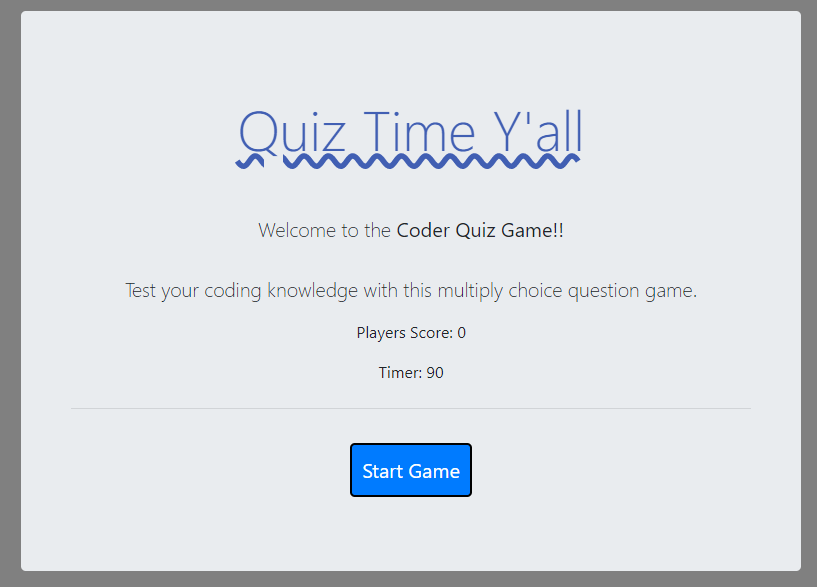
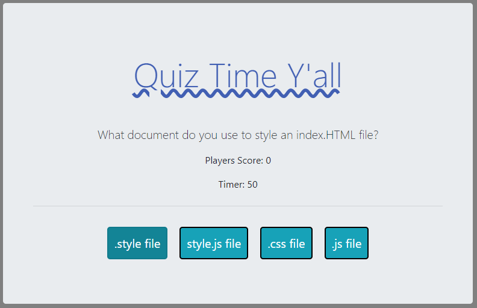
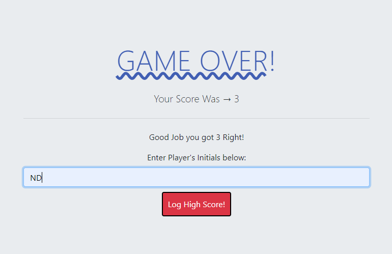

# CodeQuiz
## Challenge your coding knowledge. 

> This blog post was about creating a quiz game. 

```
    - Includes several questions
    - Includes Timer
    - Includes Player Score
```

## Home Page



## Question Page



## Player Score Page



- - -
***How many questions?***

> 4 

***How many seconds?***

> 90

***Can I log my high score?***

> Yes


## LINKS

- [Code Quiz Link](https://nicholasd-uci.github.io/CodeQuiz/)
- [Github Repo Link](https://github.com/nicholasd-uci/CodeQuiz)
- [N.P.R.D GitHub](https://github.com/nicholasd-uci)

- - -
© 2020 NPRD, Nicholas Paul Ruiz Dallas